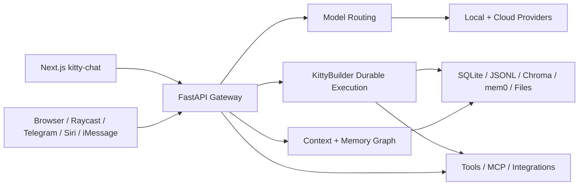
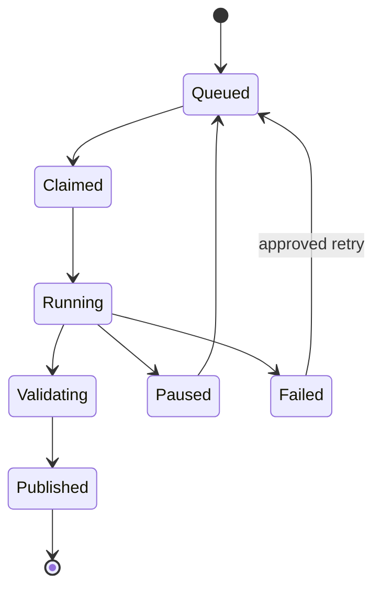
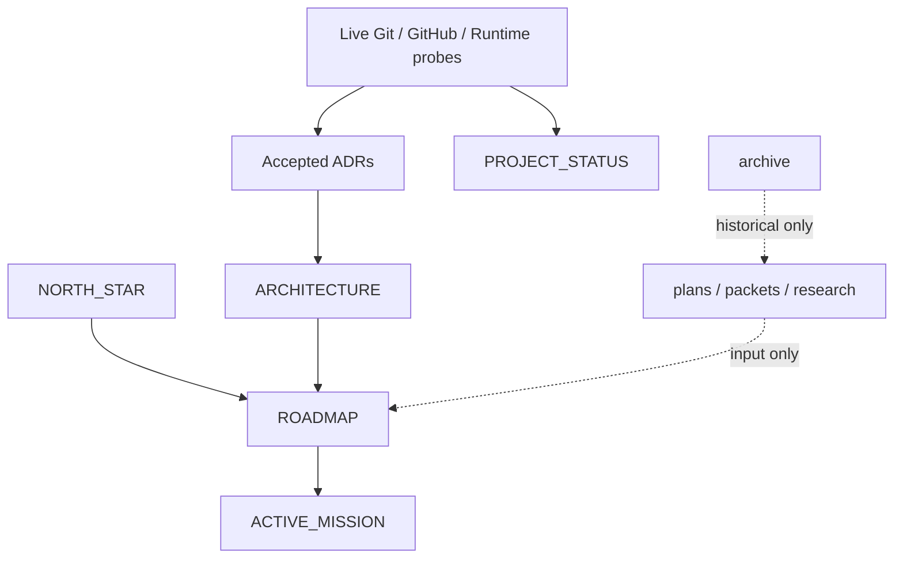

# Kitty Codebase Map

**Purpose:** a compact repository map for humans and AI tools. It describes boundaries and navigation; live Git and canonical architecture remain authoritative.

## System shape



## Top-level ownership

| Path | Owns | Start with |
|---|---|---|
| `gateway/` | Product backend, API routes, context, memory, model routing, tools, Builder | `gateway/app.py`, `gateway/routes/`, `gateway/memory_graph.py` |
| `gateway/kitty-chat/` | Next.js product interface | `package.json`, `app/`, `components/` |
| `contracts/` | Cross-layer schemas and interface contracts | directory README or schema modules |
| `soul/`, `config/` | Kitty identity, persona, and behavioral configuration | `config/SOUL.md`, `soul/kitty.md` where present |
| `mcp/` | MCP servers and external tool boundaries | per-integration README/module |
| `scripts/` | Operator, validation, migration, and maintenance tooling | script name plus corresponding tests/docs |
| `tests/` | Python unit, integration, contract, and acceptance evidence | tests matching the changed module |
| `docs/` | Canonical documentation, plans, evidence, and history | `docs/README.md` |
| `data/` | Local runtime state and databases | supported CLI/API projections, not direct prose inference |
| `logs/` | Runtime and execution evidence | bounded diagnostic use only |
| `.claude/` | Current agent checkpoint and continuation aids | `STATE.md`, `HANDOFF.md`, only when identity is valid |

## Gateway domains

The gateway is the product boundary. Important domains include:

- application startup, middleware, and lifecycle in `gateway/app.py`;
- API surfaces in `gateway/routes/`;
- unified memory reads in `gateway/memory_graph.py`;
- model selection, routing, fallback, and provider truth in routing/client modules;
- durable Builder queue, attempts, leases, reconciliation, validation, publication, and operator projections in Builder modules;
- capture, brief, journal, tutor, voice, image, project, settings, and integration surfaces;
- storage adapters and migration boundaries for SQLite, JSONL, vector, and filesystem state.

Do not add product logic to UI clients when it belongs in the gateway. Do not bypass the memory graph with a new read path without an explicit architectural decision.

## KittyBuilder boundary

KittyBuilder is delivery infrastructure inside Kitty, not a second product authority. Its durable truth lives in local runtime state and must be read through supported commands or APIs.



The diagram is orientation only. Code, accepted ADRs, and supported state projections define the real transition contract.

## Documentation authority



## Change navigation

| Change type | Inspect first | Verify with |
|---|---|---|
| API/backend | route, service/module, contract | targeted tests, mypy, ruff |
| UI | page/component, API client, shared state | frontend tests and production build |
| memory/storage | `memory_graph`, storage adapter, migration | contract tests plus persistence/restart tests |
| model/provider | routing decision, provider config, attribution | routing tests and truthful failure-path tests |
| Builder | queue/state module, operator projection, worker adapter | deterministic state-transition and recovery tests |
| docs/governance | authority map, roadmap/status/mission owner | link checks, contradiction scan, cold-start route |

## AI context bundle

Run from the repository root:

```bash
./scripts/generate_repo_context.sh
```

The script writes uploadable files under `artifacts/repo-context/`:

- `kitty-codebase.xml` — Repomix code bundle;
- `kitty-codebase.md` — Markdown bundle when supported;
- `manifest.txt` — commit and generation metadata.

The checked-in `repomix.config.json` excludes secrets, runtime state, dependencies, caches, generated artifacts, and large binary files. Review the generated bundle before uploading it anywhere.
