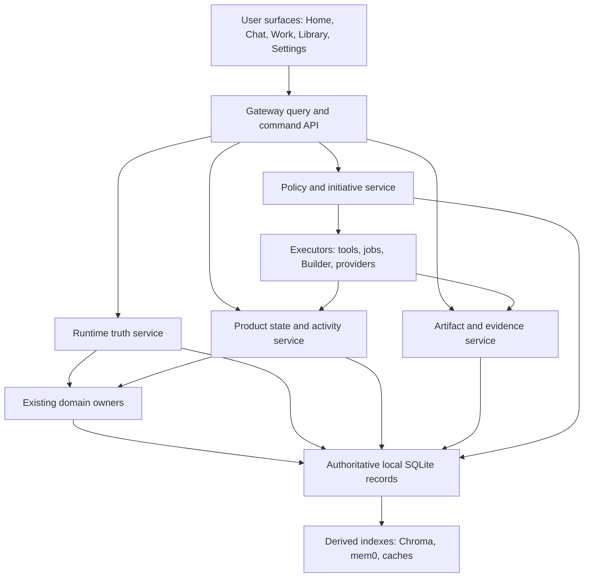
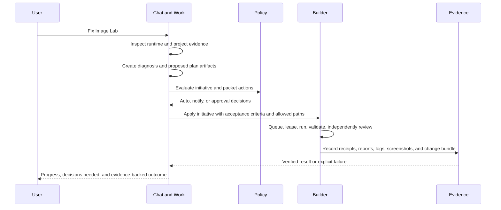

# Kitty Product Architecture

> **Control-plane ratification (2026-07-17):** ADR 0017 makes Kitty the
> principal agent and intent compiler, a versioned approved Mission the command
> boundary, and KittyBuilder the execution organization. This supersedes any
> read-only-only delegation wording in older documents. It defines the contract
> but does not enable autonomous mutation.

**Status:** Definitive product architecture and execution plan
**Date:** 2026-07-10
**Inspected commit:** `0f05ae09ad6a6f90cda4e3bf116278466f72536b`
**Scope:** Product architecture only; no implementation is included.

## Architectural decision

Kitty will become one product by adding four shared spines beneath its existing
capabilities:

1. **Runtime truth** — authoritative, current facts about Kitty, its context,
   capabilities, health, limits, and active execution.
2. **Durable product state** — explicit relationships among projects,
   conversations, work, runs, decisions, events, and notifications.
3. **Artifacts and evidence** — one lifecycle for every durable input and
   output, plus proof for every claimed result.
4. **Governed execution** — one initiative and approval policy across tools,
   the action queue, background jobs, and Builder.

Chat, Home, Brief, Builder, Image Lab, Memory, Projects, and Notifications are
not separate products. They are views and workflows over these four spines.
The FastAPI gateway remains the product owner; clients remain thin.

### Approaches considered

#### A. Incremental four-spine consolidation — chosen

Add shared contracts and identifiers first, then migrate one complete user
journey at a time. Existing domain stores and Builder machinery remain in place
behind adapters until their consumers have moved.

- **Best at:** correcting root causes without discarding working capability.
- **Trade-off:** temporary adapters and dual-read migration paths.
- **Depends on:** stable IDs, additive SQLite migrations, and strict ownership
  of runtime facts.

#### B. Unified frontend shell first — rejected

Reorganize navigation and visually connect current panels before changing the
backend contracts.

- **Best at:** producing visible progress quickly.
- **Trade-off:** preserves contradictory state, unverifiable actions, chat
  lifecycle gaps, and hardcoded runtime assumptions beneath a coherent skin.
- **Dependency:** none, which is precisely why it would be tempting and wrong.

#### C. New event-sourced operating-system core — rejected

Replace current stores and queues with a general workflow engine and full event
sourcing.

- **Best at:** theoretical uniformity and replay.
- **Trade-off:** high migration risk, long delay before user value, and a new
  framework more complex than Kitty currently needs.
- **Dependency:** a clean rewrite boundary that the current product does not
  have.

## 1. Executive diagnosis

Kitty has enough features. It lacks a shared account of what is true, what the
user is doing, what Kitty is doing, what was produced, and what evidence proves
the result.

The live repository reflects this split:

- Gateway routes are organized as independent domain islands.
- Current-state composition covers only selected domains.
- chat persistence stores client-shaped conversation blobs, while generation
  is a separate completions transport.
- the web client defines model identities independently of runtime providers.
- some runtime lookups convert failures into `unknown` or empty capability
  lists, making absence indistinguishable from failure.
- Builder has durable queues, runs, leases, recovery, and initiatives, but no
  first-class relationship to chat, artifacts, Home, or user decisions.

The result feels like an LLM embedded in a toolbox because every surface must
reconstruct context and truth for itself. Product cohesion will not come from
another dashboard or a larger system prompt. It comes from shared contracts
that every surface consumes.

## 2. Root causes

### Root cause 1 — runtime truth has no owner

Application identity, project, repository, model, provider, tools, health, and
approval limits are discovered through unrelated endpoints, local constants,
prompt assumptions, and fallbacks. Kitty therefore cannot reliably distinguish
`available`, `unavailable`, `degraded`, `stale`, and `unknown`.

**Explains:** model confusion, opaque routing, inconsistent connection state,
false capability denials, stale feature awareness, and implementation leakage.

### Root cause 2 — product state is a set of stores, not a connected model

Chats, projects, actions, Builder tasks, runs, signals, deadlines, and memories
may persist, but they do not share a durable relationship graph or common
activity envelope. Each dashboard composes a partial world independently.

**Explains:** weak continuity, fragmented Home and Brief, disconnected Builder,
fragmented notifications, and difficulty carrying work across days.

### Root cause 3 — chat is a streaming transport, not a durable work surface

Conversation blobs and completion streams do not model turns, attempts, tool
calls, attachments, artifacts, interruptions, retries, costs, or receipts as
first-class durable records.

**Explains:** incomplete chat behavior, missing attachment and artifact flows,
unreliable retry/interruption, opaque cost/model identity, and weak recovery.

### Root cause 4 — execution is not bound to evidence and policy end to end

Actions, background jobs, providers, and Builder each have useful local state,
but no universal receipt defines when Kitty may say an operation succeeded.
Approval rules are also expressed in multiple layers rather than one evaluated
policy.

**Explains:** unsupported success claims, unnecessary questions, inconsistent
initiative, manual Builder orchestration, and trust failures.

These four causes explain most observed failures. Everything that follows is a
direct response to one or more of them.

## 3. Product architecture



### Architectural responsibilities

| Layer | Owns | Must not own |
|---|---|---|
| Client | presentation, local draft editing, optimistic display | product policy, inferred capability, authoritative success |
| Gateway API | typed commands, queries, streaming, project scope | domain data duplicated in route handlers |
| Runtime truth | observed capability and active context | execution of user work |
| Product state | identities, relationships, activity projections | every domain's private implementation details |
| Artifact/evidence | durable outputs, inputs, provenance, receipts | workflow policy |
| Policy/initiative | permission decision, work decomposition, budgets | provider-specific implementation |
| Domain owners | domain logic and source facts | conflicting global projections |
| Derived indexes | search and retrieval acceleration | authoritative state |

### Non-negotiable rules

1. SQLite is authoritative for app-owned state; Chroma, mem0, caches, and
   prompt context are derived.
2. Every product-level object has a stable ID and optional `project_id`.
3. Project scope is explicit in route, query, or command contracts. It is not a
   hidden header or an inference from the current directory.
4. Cross-domain updates use one transaction where possible or an explicit
   durable reconciliation record where not.
5. Failure, stale state, and unavailable capability are distinct states.
6. A client never manufactures a capability, model, cost, or success status.
7. No general event bus, distributed worker system, new cloud service, or
   universal mega-table is required.

## 4. Runtime capability architecture

### Capability manifest

The gateway owns a versioned `CapabilityManifest`. It is composed from records
reported by the subsystem that owns each fact; it is not scraped from UI state
or invented by the model.

```text
CapabilityManifest
  schema_version
  manifest_id
  revision
  generated_at
  valid_until
  application
    name, version, build_commit, environment, base_urls
  clock
    current_time, timezone
  context
    active_project, active_repository, active_branch, working_tree_state
  execution
    builder_state, active_initiatives, active_runs, queue_summary
  inference
    routing_mode, requested_model, resolved_model, execution_location
    available_models[], provider_health[], pricing_metadata_age
  connections[]
    id, display_name, state, observed_at, evidence_ref
  tools[]
    id, display_name, availability, constraints, approval_class
  features[]
    id, availability, reason, owner, observed_at
  approvals
    policy_version, boundaries, pending_decisions
  health[]
    component, state, observed_at, latency, error_ref
```

Every dynamic item carries:

- `state`: `available | unavailable | degraded | stale | unknown`;
- `observed_at` and `valid_until`;
- `source`: the owning subsystem;
- `evidence_ref`: the probe, record, or receipt supporting the claim; and
- a safe user-facing reason when it is not available.

`unknown` means the truth could not be established. It must never be rendered
as `unavailable`, treated as success, or silently replaced with a default.

### Ownership and freshness

- App version and build commit come from the launcher/build metadata.
- Time and timezone come from the host clock at request time.
- active project comes from persisted product context.
- repository state comes from a bounded repository probe.
- Builder state comes from Builder's durable stores.
- model availability and provider health come from live provider/router probes.
- tool availability comes from the actual tool registry plus dependency probes.
- approval boundaries come from the policy engine's active version.

Freshness is field-specific. Host time may be computed per request; repository
state may be valid for seconds; provider pricing may remain valid longer. An
expired field becomes `stale`; the composer does not extend its life because a
probe failed.

The manifest supports:

- a full snapshot query for startup and diagnostics;
- revisioned patches over server-sent events for live clients;
- a compact prompt projection containing only facts relevant to the current
  request; and
- immutable snapshot references attached to turns and execution receipts.

This prevents prompt bloat while preserving the exact runtime truth Kitty used.

### Assistant consumption

Before a turn is dispatched, the gateway binds the turn to:

1. explicit project scope;
2. a manifest revision;
3. allowed tools and approval boundaries; and
4. requested routing preference.

The model receives structured runtime context. Tool availability is enforced by
the executor, not merely described in the prompt. If a required fact is stale,
Kitty either refreshes it visibly or states that it cannot verify it.

### User presentation

Normal mode shows product language:

- `Kitty Auto · GPT-5.4 · Cloud`;
- `Local tools connected`;
- `Builder paused — approval needed`;
- `Gateway unavailable — last checked 14:32`.

Advanced diagnostics may expose provider IDs, routing chains, endpoint names,
latency, raw health details, and manifest revisions. Internal concepts do not
leak into ordinary workflows.

## 5. Unified product state architecture

Kitty needs a connected product graph, not one polymorphic table that replaces
every domain store.

### Canonical product entities

| Entity | Purpose |
|---|---|
| `Workspace` | top-level continuity boundary; initially one local workspace |
| `Project` | explicit scope for repo, knowledge, chats, work, and artifacts |
| `Conversation` | durable user/assistant work context |
| `Turn` | one user intent and its response attempts |
| `WorkItem` | a user-visible commitment, decision, or delegated unit of work |
| `Initiative` | ordered/dependent collection of Builder packets |
| `Run` | one execution attempt by a tool, job, provider, or Builder worker |
| `Artifact` | durable input or output with provenance |
| `Decision` | approval, rejection, policy exception, or explicit choice |
| `ActivityEvent` | append-only statement that a meaningful state transition occurred |
| `Notification` | delivery/projection state for an event requiring awareness |

Domain records keep their own schemas. Product entities link them using typed
references such as `subject_type`, `subject_id`, `project_id`, `conversation_id`,
`work_item_id`, and `run_id`.

### Activity event envelope

```text
ActivityEvent
  id, occurred_at, recorded_at
  kind, actor_type, actor_id
  project_id
  subject_ref
  parent_ref
  conversation_id, work_item_id, run_id
  summary
  artifact_refs[]
  receipt_ref
  visibility
```

Events are append-only facts for projections and audit. They do not replace the
current state tables that enforce domain invariants.

### Product state projections

One gateway query service builds consistent projections:

- **Now:** active context, current work, active execution, health, and pending
  decisions.
- **Changed:** verified activity since a cursor, grouped by project and work.
- **Needs attention:** approvals, failed work, stale capabilities, deadlines,
  and interrupted conversations.
- **Resume:** the last meaningful state of a project, with next actions and
  source links.
- **Brief:** a narrative projection over the same facts, not a separate store.

Home, Brief, notifications, and the assistant all consume these projections.
They may format or filter them, but they cannot independently decide what is
true.

## 6. Chat architecture

Chat becomes the primary command and collaboration surface over Kitty, while
remaining one view of product state rather than the entire product.

### Durable chat model

```text
Conversation
  id, project_id, title, created_at, updated_at, archived_at

Turn
  id, conversation_id, sequence, user_message_id
  manifest_revision, status, created_at, completed_at

Message
  id, turn_id, role, content, content_format, status, created_at

GenerationAttempt
  id, turn_id, attempt_number
  requested_route, resolved_provider, resolved_model, execution_location
  status, started_at, completed_at, token_usage, cost, error_ref

ToolCall
  id, attempt_id, tool_id, arguments_digest, approval_decision_id
  status, execution_receipt_id

AttachmentLink / ArtifactLink
  message_id or turn_id, artifact_id, relationship
```

The existing client-shaped chat blob becomes a compatibility representation,
not the source model.

### Message and attempt lifecycle

The explicit states are:

```text
draft -> queued -> sending -> streaming -> complete
                     |           |          |
                   failed    interrupted   superseded
```

- Persist the user message and turn before dispatch.
- Create an attempt before contacting a provider.
- Persist bounded partial checkpoints during streaming.
- `[DONE]` or an equivalent provider terminal event is required for `complete`.
- Network loss produces `interrupted`, preserving partial content.
- Retry creates a new attempt; it never silently overwrites the failed one.
- Regenerate and provider switch are new attempts tied to the same turn.
- Stop requests are durable and distinguish user interruption from failure.

### Attachments

Dropping or selecting a file creates an artifact immediately with hash, media
type, size, source, and ingestion state. Extraction and indexing are explicit
runs. The message links to the artifact, not to an ephemeral browser object.

The composer may only claim attachment understanding when extraction/indexing
receipts prove it. Citations point to artifact-local spans or pages.

### Artifacts in chat

Generated images, documents, reports, screenshots, patches, and exports appear
as typed artifact cards in the turn. The same artifacts are visible in Work,
Library, Home activity, Brief, and notifications without copying files or
inventing parallel metadata.

### Connection, identity, reasoning, and cost

- Show gateway connection independently from provider/model health.
- Show the user's routing choice and the actual resolved model after dispatch.
- Show local versus cloud execution from the attempt record.
- Show token and cost data only when reported or calculated from fresh pricing;
  otherwise display `not reported`, never `$0`.
- Show tool progress and concise reasoning summaries when available. Do not
  expose hidden chain-of-thought or fabricate reasoning detail.

### Offline behavior and queued sends

Drafts persist locally and sync to the gateway when connected. Sending while
offline requires an explicit queued-send state visible to the user. An offline
message is never displayed as sent. Queue replay is ordered and idempotent;
project and manifest context are revalidated before dispatch.

## 7. Builder integration architecture

Builder is the governed execution engine behind user-visible **Work**. Its
internal terms remain available in diagnostics, while normal product language
uses plans, tasks, runs, reviews, and results.

Kitty—not a separate project-manager runtime—owns conversation, selective
context retrieval, missing-context detection, assumption challenge, evidence
planning, and Mission compilation. Builder owns decomposition, worker/model
routing, context packaging, budgets, attempts, validation, recovery,
publication, and evidence. Workers are replaceable and never own project truth.
Routing targets 90–95% of available quality at materially lower cost and
escalates only when evidence or risk justifies it. Results include concise
teach-back, while proactivity remains relevant and permission-scoped.

### End-to-end delegation flow



### Integration contract

Every delegated initiative contains:

- project and repository identity;
- user objective and constraints;
- diagnosis and plan artifact references;
- ordered packets and dependencies;
- allowed paths and forbidden operations;
- acceptance criteria and declared verification;
- approval policy version;
- attempt/time/cost budgets; and
- the conversation and work item that originated it.

Existing Builder queue, lease, recovery, runner, review, and initiative tables
remain the execution source of truth. Stable bridge IDs connect their tasks and
runs to product `WorkItem`, `Run`, `Artifact`, and `ActivityEvent` records.

### Product behavior

- Chat can propose and start permitted Builder work.
- Work shows the initiative graph, current packet, run status, evidence, and
  decisions needed.
- Home shows only material changes and blockers, not worker noise.
- Brief summarizes progress using the same Builder events.
- A notification is created for a failed/blocked run or approval boundary, not
  for every transition.
- Completion requires accepted validation and review receipts. A process exit
  code alone is not sufficient.

The self-building roadmap remains valid. Its context bundles, result contracts,
validation, independent review, bounded repair, PR reconciliation, budgets, and
restart recovery become the execution foundation for this product integration.

## 8. Artifact architecture

An artifact is any durable input or output the user may need to inspect, reuse,
cite, approve, or recover later.

### Artifact contract

```text
Artifact
  id, project_id
  kind, media_type, display_name
  state: pending | ready | failed | archived
  storage_uri, content_hash, size_bytes
  created_at, created_by
  source_ref, run_id, conversation_id, work_item_id
  provenance
  metadata
  preview_ref
  error_ref
```

Initial kinds include `attachment`, `image`, `document`, `builder_report`,
`log`, `screenshot`, `export`, `generated_file`, `change_bundle`, and `plan`.
Kinds may have typed metadata, but all share identity, lifecycle, provenance,
relationships, and access rules.

### Artifact lifecycle

1. **Declare:** create a pending record before work starts.
2. **Produce or ingest:** executor writes through an atomic storage boundary.
3. **Verify:** hash, size, media validation, and domain checks produce evidence.
4. **Publish:** transition to ready and emit one activity event.
5. **Use:** link from messages, work, runs, notifications, Home, or Brief.
6. **Archive:** hide without silently destroying provenance.

A failed artifact remains visible with its error. A database record must not
point to a file that was never durably written.

### Storage

Metadata lives in the main Kitty database. Binary and large text content may
remain on the local filesystem behind stable URIs. The artifact service owns
path allocation and atomic publication. Existing image files, logs, Builder
reports, and exports are registered in place during migration before any file
movement is considered.

## 9. Initiative and approval architecture

Initiative is a policy decision, not merely a model personality trait. The
policy engine evaluates a proposed action using:

- action kind;
- target and project scope;
- read/write/destructive impact;
- reversibility;
- local versus external effect;
- privacy boundary;
- monetary cost;
- credential/auth implications;
- declared user authority; and
- active repository policy.

### Decision classes

| Class | Default behavior | Examples |
|---|---|---|
| Act automatically | execute and include in normal progress | read-only inspection, retrieval, health probes, drafting, local calculations |
| Act and notify | execute, record receipt, surface material result | create a reversible local work item, queue approved-scope work, save an artifact, create an isolated local worktree |
| Request approval | create a decision and pause before effect | push/merge, delete, external message, auth/env/secret changes, paid execution, heavy dependency, broad scope expansion |
| Refuse | do not execute; explain the boundary | credential exfiltration, unverifiable authority, action forbidden by policy, unsafe request that cannot be constrained |

Repository and user policy can make a default stricter. The model cannot make
it looser. Approval decisions are scoped, expiring, and recorded; approval of
one push does not grant permanent push authority.

### Useful initiative policy

Kitty should avoid unnecessary questions by doing the safe preparatory work
first. When asked to “Fix Image Lab,” it may inspect, diagnose, draft a plan,
identify affected paths, define acceptance criteria, and prepare an initiative
before asking for a boundary decision. Questions are reserved for choices that
materially change outcome, authority, cost, or destructive scope.

## 10. Trust and verification architecture

### Execution receipt

Every command that causes work returns or eventually resolves to an
`ExecutionReceipt`:

```text
ExecutionReceipt
  id, operation_id, idempotency_key
  action_kind, executor, target_refs
  status: accepted | running | succeeded | failed | cancelled | interrupted
  started_at, finished_at
  manifest_revision, policy_decision_id
  input_digest
  evidence_refs[]
  output_artifact_refs[]
  warnings[]
  error
    code, message, status_code, retryable, context_ref
```

Kitty may say “completed,” “saved,” “sent,” “generated,” “tested,” or “fixed”
only when the relevant receipt is `succeeded` and contains the evidence required
for that action kind.

### Evidence requirements

| Claim | Minimum evidence |
|---|---|
| file saved | durable path, hash, and successful atomic write |
| image generated | ready image artifact plus media validation |
| message sent | connector/provider delivery acknowledgement |
| code fixed | change bundle plus declared validation receipts |
| Builder packet complete | runner success, deterministic checks, independent review outcome |
| connection available | unexpired successful owner probe |
| model used | provider response metadata for the actual attempt |
| cost | usage record plus current pricing source, or provider-reported charge |

Failures preserve status codes, operation parameters with secrets redacted, and
response context. A bounded retry emits a visible warning; exhaustion records
and raises the real error. No null/default success, empty catch, or silent
fallback is valid product behavior.

### Trust presentation

Normal UI shows a concise status and expandable evidence. Advanced diagnostics
show receipts, manifest revisions, probes, logs, and raw identifiers. The goal
is not maximum telemetry on screen; it is a short path from any claim to its
proof.

## 11. Information architecture

### Primary navigation

1. **Home** — what changed, what needs attention, what is active, and the next
   best action.
2. **Chat** — conversations and direct collaboration with Kitty.
3. **Work** — delegated work, initiatives, runs, decisions, and results.
4. **Library** — artifacts, sources, memory views, images, and generated files.
5. **Settings** — identity, connections, models, permissions, notifications,
   and advanced diagnostics.

Project scope is persistent and visible above these destinations. Switching
project updates all projections together.

### Existing surfaces

- **Brief** becomes a saved/generated Home summary, not a separate truth path.
- **Builder** powers Work; “Builder” remains an advanced product term.
- **Image Lab** becomes a focused creation view over Library artifacts and the
  same generation runs available from Chat.
- **Memory** is accessed through Library and automatic context, with provenance
  and correction controls.
- **Notifications** are an attention projection, not a destination containing
  unique state.
- **Projects** become the global scope switcher and resume surface, not an
  isolated panel.

### Product language

Prefer `Work`, `Plan`, `Run`, `Needs approval`, `Local`, `Cloud`, `Connected`,
and `Evidence`. Reserve queue IDs, provider abstraction, routing chain, MCP,
lease, packet, manifest revision, and similar implementation terms for advanced
diagnostics.

## 12. User workflow architecture

### A. Resume meaningful work

1. Open Kitty into the last active project.
2. Home shows verified changes, current work, decisions needed, and next action.
3. Resume opens the relevant conversation and linked artifacts.
4. Kitty receives the same project, runtime, and work context automatically.

### B. Ask with sources

1. Attach files in Chat.
2. Each file becomes a visible ingesting/ready/failed artifact.
3. Kitty answers only from successfully processed sources and cites artifact
   locations.
4. The conversation and sources remain linked after restart.

### C. Create an image

1. Ask in Chat or open Image Lab from the same project.
2. Generation appears as a run with actual model/location and progress.
3. The image becomes one artifact visible in the turn and Library.
4. Variations link to the original rather than creating a disconnected history.

### D. Delegate “Fix Image Lab”

1. Kitty inspects the project and runtime without asking avoidable questions.
2. Diagnosis and plan appear as artifacts.
3. Policy permits preparation and pauses only at genuine approval boundaries.
4. Work displays packets, current run, review, evidence, and blockers.
5. Chat reports a verified outcome with change and review artifacts.

### E. Handle interruption honestly

1. Network/provider loss changes the attempt to interrupted or failed.
2. Partial response remains labeled and recoverable.
3. Retry creates a new attempt with its actual route and cost.
4. Home shows the interruption only if it still needs attention.

### F. Daily Brief

1. Brief queries the same state used by Home.
2. It prioritizes decisions, failures, deadlines, and material progress.
3. Every statement links to its work, event, artifact, or receipt.
4. A missing source produces an explicit incomplete section, not invented prose.

## 13. Recommended implementation sequence

Each phase pairs an architectural backbone improvement with a visible user
reward. This preserves the Minimum Compelling Kitty direction.

### Phase 0 — Contract freeze and migration inventory

- Define versioned schemas for manifest, activity event, artifact, receipt,
  policy decision, and chat lifecycle.
- Assign source owners and IDs to existing project/chat/action/Builder records.
- Inventory legacy chat blobs, generated files, logs, reports, and unscoped data.
- Add contract fixtures and architecture decision records before migrations.

**Visible reward:** none; cap this phase to one small contract packet.

### Phase 1 — Runtime truth plus honest identity

- Implement the manifest composer, owner probes, freshness semantics, snapshot
  endpoint, and compact prompt projection.
- Make active project/repository explicit.
- Bind each chat attempt to a manifest revision.
- Replace hardcoded model/connection identity in Chat with live truth.

**Visible reward:** Chat always shows Kitty identity, actual model/location,
connection state, and stale/unavailable reasons accurately.

### Phase 2 — Durable chat plus attachments

- Add normalized conversations, turns, messages, attempts, and tool calls.
- Persist before dispatch; implement interruption, retry, stop, drafts, and
  visible queued-send states.
- Introduce attachment artifacts and ingestion receipts.
- Backfill existing chat blobs into the default scoped project.

**Visible reward:** modern reliable Chat with attachments, restart continuity,
honest streaming, retry, and source citations.

### Phase 3 — Artifact/evidence spine plus Image Lab

- Add artifact registry, local storage boundary, provenance, previews, and links.
- Add execution receipts and evidence requirements to image generation and core
  tool actions.
- Register existing images/reports/logs in place.
- Render shared artifact cards in Chat and Library.

**Visible reward:** Image Lab and Chat share one generation history and reusable
outputs; Kitty cannot claim generation success without an artifact.

### Phase 4 — Product state plus Home/Brief/notifications

- Add activity events and cross-domain relationships.
- Implement Now, Changed, Needs attention, Resume, and Brief projections.
- Convert existing state composer and signals into projection inputs.
- Replace independent Home/Brief notification logic with those queries.

**Visible reward:** one useful Home that resumes work and surfaces only material
changes and decisions.

### Phase 5 — Governed Builder as Work

- Bridge product work/run IDs to Builder initiatives, packets, tasks, and runs.
- Complete the self-building roadmap contracts, validation/review, bounded
  repair, continuation, budgets, and reconciliation.
- Apply policy decisions and receipts end to end.
- Add Work views and Chat delegation.

**Visible reward:** “Fix Image Lab” becomes a monitored, recoverable, reviewed
workflow with evidence and minimal babysitting.

### Phase 6 — Consolidation and retirement

- Move remaining consumers to shared contracts.
- Remove hardcoded client capability/model catalogs and obsolete truth paths.
- Retire compatibility reads only after parity evidence and a rollback window.
- Align docs, evals, and operator runbooks to the shipped architecture.

**Visible reward:** consistent language, settings, diagnostics, and behavior
across all surfaces.

## 14. Parallelizable workstreams

Parallel work begins only after Phase 0 contracts are frozen. Each workstream
owns distinct files/tables and integrates through versioned fixtures.

| Workstream | Can proceed with | Integration gate |
|---|---|---|
| Runtime manifest and probes | chat identity UI | manifest contract fixtures |
| Chat lifecycle storage/API | attachment ingestion | turn/attempt IDs and artifact link contract |
| Artifact registry/storage | Image Lab adapter and cards | artifact lifecycle/receipt fixtures |
| Activity projections | Home and Brief presentation | event envelope and cursor semantics |
| Policy decisions | Builder bridge | action taxonomy and receipt contract |
| Legacy inventory/backfill tooling | all additive feature work | dry-run reports and count/hash reconciliation |
| Journey eval harness | every phase | stable acceptance scenarios and seeded fixtures |

Do not parallelize schema redesigns that compete for the same identity model,
or let UI work invent temporary contracts while backend contracts are unsettled.

## 15. Risks and mitigations

| Risk | Consequence | Mitigation |
|---|---|---|
| Product state becomes a god object | new bottleneck and brittle schema | keep domain owners; link through typed refs and events |
| Manifest reports stale truth | confident false claims | field TTLs, owner probes, evidence refs, explicit stale state |
| Prompt is overloaded with runtime data | cost and degraded answers | task-relevant compact projection plus snapshot ref |
| Dual-write migration diverges | lost or contradictory records | one authoritative writer, shadow reads, reconciliation reports |
| Chat normalization loses history | continuity regression | additive backfill, preserve raw legacy blob, count/hash checks |
| Artifact abstraction is too generic | lowest-common-denominator UX | common envelope plus typed metadata per artifact kind |
| Evidence is present but meaningless | false confidence | action-specific evidence policies and independent review |
| Builder acts beyond user intent | trust or repo damage | allowed paths, budgets, policy version, scoped approvals, stop controls |
| Home becomes another noisy dashboard | low product value | attention-ranked projections and material-event rules |
| Provider cost data is stale | misleading price display | timestamped pricing; show not reported when unverifiable |
| Local SQLite contention | slow or failed UI/workflows | short transactions, WAL, bounded projections, background indexing |
| Existing Builder branch work drifts | duplicate or conflicting designs | treat current initiative/runner contracts as inputs, not rewrite targets |

## 16. Migration strategy

1. **Add, do not replace.** Introduce tables and contracts through additive
   migrations. No destructive table or file operation is part of early phases.
2. **Create a default Personal workspace/project.** Map legacy unscoped chats,
   memories, knowledge, and artifacts to it with explicit migration metadata.
3. **Backfill stable IDs.** Preserve old IDs as external IDs so links and logs
   remain traceable.
4. **Normalize chats safely.** Parse each legacy chat blob into conversation,
   turn, message, and attempt records while retaining the original serialized
   record until cutover is proven.
5. **Register artifacts in place.** Hash and index existing images, reports,
   exports, screenshots, and logs without moving or deleting them.
6. **Bridge, do not rewrite, Builder.** Add product references to existing
   initiative/task/run records and emit activity/receipt records at durable
   transitions.
7. **Shadow projections.** Compare old and new Chat/Home/Brief reads on seeded
   and real local data; log mismatches loudly.
8. **Cut over one journey at a time.** Switch the writer first, then reads, then
   client presentation. Maintain a documented rollback per phase.
9. **Retire only with evidence.** Remove compatibility paths after record counts,
   hashes, journey checks, restart recovery, and a soak period pass.

## 17. Phase acceptance criteria

### Phase 0

- Each shared contract is versioned, documented, and has valid/invalid fixtures.
- Every field has a named owner and freshness/authority rule.
- The migration inventory reports counts and locations without mutation.
- No contract requires a new database, cloud service, or distributed bus.

### Phase 1

- A single manifest accurately reports app/build, clock/timezone, project/repo,
  Builder, providers/models, tools, connections, health, and approvals.
- Expired or failed probes render stale/unknown with a specific reason.
- The assistant and UI use the same manifest revision.
- Requested and actual model/location are distinguishable for every attempt.
- No client hardcoded model is presented as currently available without runtime
  evidence.

### Phase 2

- A user can attach a source, receive a cited answer, restart Kitty, and resume
  with the same messages and source links.
- A user message exists durably before provider dispatch.
- interrupted, failed, stopped, retried, and complete attempts remain distinct.
- Offline drafts and queued sends cannot appear sent prematurely.
- Legacy chat migration reconciles every source record or fails with an exact
  record-level report.

### Phase 3

- Images, generated files, Builder reports, logs, screenshots, and exports share
  one discoverable artifact identity and provenance envelope.
- Chat and Image Lab display the same image artifact and generation status.
- Every successful artifact-producing action has a ready artifact plus required
  evidence; failed production remains visible as failed.
- Existing files are registered without destructive movement.

### Phase 4

- Home, Brief, and notifications derive from the same activity/state queries.
- Switching project changes all three consistently.
- Resume reconstructs the active conversation, work, artifacts, and next action.
- Every Brief assertion links to a source event, record, artifact, or receipt.
- A down or stale subsystem produces an honest incomplete projection, not a
  plausible default.

### Phase 5

- From Chat, “Fix Image Lab” can produce a diagnosis, plan, initiative, packet
  runs, validation, independent review, and evidence-backed report.
- Safe preparation proceeds without unnecessary questions.
- Approval boundaries pause before effect and survive restart.
- attempt/time/cost limits stop or pause work with a specific durable reason.
- No packet completes on worker assertion or exit code alone.
- Home and Work show progress and blockers from Builder's durable state.

### Phase 6

- Product language is consistent across primary surfaces.
- Advanced diagnostics retain access to provider, routing, receipt, and manifest
  detail without exposing it by default.
- Old truth paths and compatibility reads are removed only after parity and
  rollback evidence.
- End-to-end journey checks cover source chat, image creation, project resume,
  Builder delegation, failure, interruption, and approval.

## Adversarial review and corrections

The design was stress-tested against five questions.

1. **Weakest assumption:** a shared state layer automatically creates
   coherence. It does not. **Correction:** domain stores retain ownership; only
   identities, relations, events, and projections are shared.
2. **If runtime facts are wrong:** Kitty becomes confidently wrong at a larger
   scale. **Correction:** source ownership, per-field TTLs, evidence references,
   and explicit stale/unknown states are part of the contract, not follow-up
   hardening.
3. **Unhandled edge:** partial streams and executor crashes can produce an
   output without a terminal status. **Correction:** attempts and pending
   artifacts exist before execution; recovery reconciles them to interrupted or
   failed, never silently complete.
4. **Likely rushed omission:** migrations could destroy the continuity this
   architecture is meant to improve. **Correction:** additive backfills,
   preserved originals, dry-run reconciliation, shadow reads, and per-phase
   rollback are acceptance requirements.
5. **Simpler valuable version:** build only the manifest and identity strip.
   **Decision:** that is the first implementation packet, but not the stopping
   point; truth without durable chat/evidence still leaves the main product
   broken.

## Go decision and first implementation packet

**GO**, with the incremental four-spine architecture and phase order above.

The first packet should be **KPA-01 — Runtime Truth v1 + Honest Chat Identity**:

- define `CapabilityManifest` v1 and owner/freshness rules;
- compose app/build, time/timezone, project/repository, Builder summary,
  provider/model availability, tools, connections, health, and approval limits;
- expose a snapshot API and compact prompt projection;
- bind a chat attempt to the manifest revision and record requested versus
  resolved model/location; and
- replace static Chat model/connection identity with the live, user-readable
  status.

Keep KPA-01 read-oriented and additive. It must not redesign all settings,
normalize chats, migrate artifacts, or automate Builder. Its visible proof is
simple: Kitty and the user see the same current identity and capability truth,
and a failed probe is unmistakably a failure rather than a fabricated default.
