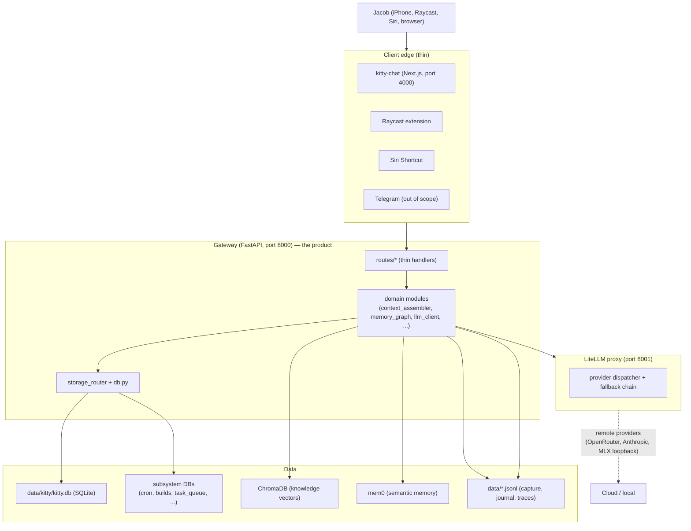

# 00 — Overview

**Kitty is a local-first personal AI companion** running on Jacob's Mac.
It is one user, one machine, one gateway.

## What it actually is

Kitty is a **state store + capture-and-triage loop + action queue with
enforced approval tiers + model-delegation router**, worn with a SOUL
persona. Chat is one interface to that layer, not the product
([ADR-0010](../adr/0010-kitty-is-personal-operating-layer.md)).

The macOS launcher `./kitty` is the operator entry point:
`./kitty up | down | status | doctor | logs | backup | delegate | push`.

## Subsystems at a glance

## How a request becomes work

1. A client (browser, phone, Raycast) hits the gateway over localhost or
   Tailscale.
2. The route handler (`gateway/routes/*.py`) is a thin shim — it
   delegates to a domain module.
3. The domain module assembles context, decides what to call, dispatches
   to LiteLLM, and writes results back to a store.
4. LiteLLM routes the call to the right provider, with a fallback chain
   in case the primary is down.
5. The route returns a response. State changes are committed to SQLite
   _before_ the response, so capture-then-crash never loses the write.

## What the gateway is NOT

- Not a multi-tenant service. One user, one machine ([ADR-0002](../adr/0002-local-first-single-user.md)).
- Not a chat product. Chat is one window onto the state layer.
- Not a memory substrate. It uses SQLite + ChromaDB + mem0 + JSONL;
  it does not invent a new one.
- Not a notification system. It pushes to iMessage or Pushover when it
  needs Jacob's eyes; it does not assume an app is open
  ([ADR-0013](../adr/0013-phone-first-delivery-move-in-bar.md)).
