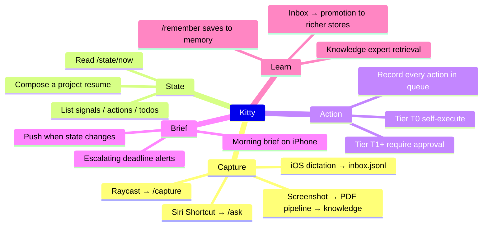

# 10 — Capabilities

What you can ask Kitty to do, grouped by trigger. Each capability maps
to a route and a domain module.

## Capture (the highest-value moment)

## By trigger

**On capture (from phone, Raycast, Siri):** Quick Capture writes to
`data/inbox.jsonl`. The capture path is durable without the gateway or
the LLM proxy being up — JSONL is the failure-safe substrate
([ADR-0005](../adr/0005-keep-inbox-jsonl-for-capture.md)).

**On "ask" (chat):** The `/ask` route runs the request through the
context assembler, memory_graph, and LLM dispatcher. Reply is a string;
side effects (a signal, a todo) are recorded as separate rows.

**On cron tick:** A connector (mail, web monitor, etc.) fetches new
external state, emits a deduped `signal` row, and exits. A later
consumer (the morning brief, an action-queue scan) picks it up. No
autonomous outbound action happens in this path.

**On morning brief:** A scheduler composes "what changed overnight +
what's due today + what needs your eyes" and pushes to iMessage or
Pushover. Jacob sees it on his phone; he does not open Kitty to find
it ([ADR-0013](../adr/0013-phone-first-delivery-move-in-bar.md)).

**On "what's B" (next-step navigator, packet 016):** Compose the project's
state (`projects.resume()`) and ask the LLM for one concrete next step
and what's already done. Output is a single recommendation, not a plan.

**On action execution:** The action queue records the action, runs it
through the approval tier, and writes the result. Tier T0 actions
(self-execute, read-only) run automatically. Tier T1+ pause for
explicit approval. Every action is auditable in the queue.

**On "remember":** A `/remember` skill saves the fact to memory (mem0 or
the knowledge base) so it can be recalled in a future prompt or brief.

## What Kitty will NOT do

- Send mail, label mail, archive mail, delete mail. Read-only Gmail
  only ([ADR-0012](../adr/0012-mail-connector-gmail-readonly.md)).
- Route journal, mail-body, health-admin, or uploaded-document content
  to cloud models. Local-only is enforced in `call_llm`
  ([ADR-0011](../adr/0011-privacy-boundary-in-llm-router.md)).
- Take an autonomous outbound action without a recorded queue row and
  (for T1+) a human approval.
- Open an app unprompted. Jacob is phone-first; pushes go to him, not
  the other way.
