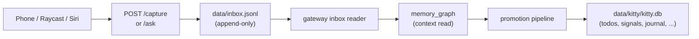
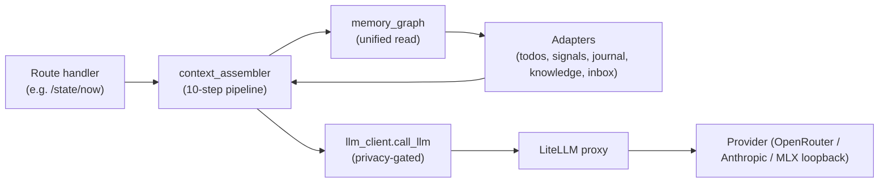
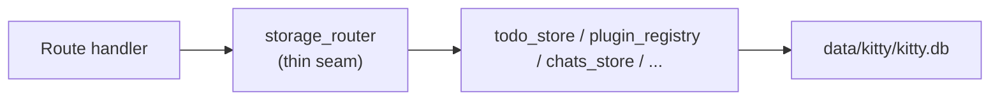
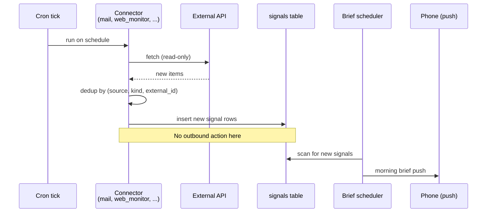

# 20 — Dataflow

Where data enters, how it transforms, where it lands, who reads it back.

## Capture path (the most-frequent write)

The inbox JSONL is the **capture contract**. It is mobile-compatible
(append-only, line-oriented) and is allowed to coexist with SQLite
because capture must work even when richer app state is broken
([ADR-0005](../adr/0005-keep-inbox-jsonl-for-capture.md)).

## Read path (the most-frequent query)

Every context read goes through `memory_graph`
([ADR-0004](../adr/0004-memory-graph-owns-context-reads.md)). The
context assembler is the only sanctioned entry point for prompt
construction. The LLM client is the only sanctioned entry point for
remote LLM calls that may carry private content
([ADR-0011](../adr/0011-privacy-boundary-in-llm-router.md)).

## Write path (state mutation)

`storage_router` is a **deliberately thin** wrapper — it is not a port,
not an adapter registry, not a fallback engine
([ADR-0008](../adr/0008-storage-router-thin-write-seam.md)). Its job is
"every write goes through one module." The substrate can change later
if a real migration needs it; the seam does not pre-pay for that.

New state-spine stores (signals, actions, projects) **do not** go
through `storage_router` — they are new read/write modules of their own,
each over `kitty.db` migrations.

## External feed path (mail, web monitor, etc.)

## Async / streaming result path

When a request needs an LLM stream (long chat, brief generation), the
route returns a streaming response from LiteLLM. State writes happen
**before** the stream starts, so a mid-stream crash does not lose the
write. If the stream fails, the partial result is logged to
`data/token_log.jsonl` and the route returns an error — the state
mutation still stands.

## What does NOT flow

- Personal content (journal, mail-body, health-admin, uploaded
  documents) never leaves the local boundary at the LLM step, even
  when a cloud model is otherwise fine for the call
  ([ADR-0011](../adr/0011-privacy-boundary-in-llm-router.md)).
- The Mail connector does not push to a webhook. It is cron-polled and
  read-only ([ADR-0012](../adr/0012-mail-connector-gmail-readonly.md)).
