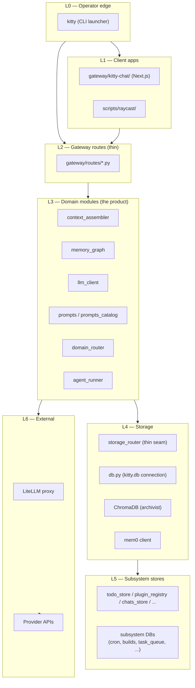

# 30 — Codemap

How the code is laid out, what depends on what, and the architectural
rules you cannot break without rewriting the codebase.

## Layers (top to bottom)

Dependency direction is **down only**. A higher layer may import a
lower layer; the reverse is a code smell.

## Architectural invariants (rules expressed as absences)

The interesting rules in this codebase are often the things that are
**not** there. If you find yourself adding one of these, stop and
re-think.

| Invariant                                                               | What it forbids                                                                                                   |
| ----------------------------------------------------------------------- | ----------------------------------------------------------------------------------------------------------------- |
| **No product logic in routes**                                          | `gateway/routes/*.py` is thin; logic lives in domain modules.                                                     |
| **No direct context reads in routes or prompt code**                    | All reads go through `memory_graph` ([ADR-0004](../adr/0004-memory-graph-owns-context-reads.md)).                 |
| **No remote LLM call without `call_llm`**                               | Bypassing the privacy boundary is a privacy incident ([ADR-0011](../adr/0011-privacy-boundary-in-llm-router.md)). |
| **No new memory substrate in Phase B**                                  | One storage story, one operating story ([ADR-0006](../adr/0006-phase-b-is-consolidation.md)).                     |
| **No `storage_router` methods for stores that don't have a write seam** | The router is thin; it does not become a port ([ADR-0008](../adr/0008-storage-router-thin-write-seam.md)).        |
| **No autonomous outbound action without a queue row**                   | Tier T0 may self-execute; T1+ requires approval.                                                                  |
| **No Telegram as a delivery assumption**                                | Push goes to iMessage or Pushover ([ADR-0013](../adr/0013-phone-first-delivery-move-in-bar.md)).                  |
| **No new database without an ADR**                                      | Each new SQLite file is a debt; explain it before adding.                                                         |

## Where to look when...

| You want to ...                            | Look in                                                                                          |
| ------------------------------------------ | ------------------------------------------------------------------------------------------------ |
| Add a new HTTP route                       | `gateway/routes/` (handler) + a new or existing domain module (logic)                            |
| Change how prompts are built               | `gateway/context_assembler.py` (the 10-step pipeline)                                            |
| Add a new LLM provider                     | `gateway/llm_client.py` (the dispatcher) + `gateway/litellm_config.yaml` (provider config)       |
| Add a new state table                      | `gateway/db.py` (connection) + `gateway/migrations/` (schema) + a new module under `gateway/`    |
| Add a new connector (mail, calendar, etc.) | New `gateway/<connector>.py`, scheduled by `gateway/cron.py`, emits signals to the signals table |
| Change the SOUL/persona                    | `config/SOUL.md` (text) + `gateway/prompts.py` (loader)                                          |
| Add a new packet (work unit)               | `docs/packets/NNN-slug.md` (template at `docs/packets/TEMPLATE.md`)                              |
| Add a new decision                         | `docs/adr/` (template at `docs/adr/0000-template.md`)                                            |

## The "removed modules" pile

The gateway explicitly deletes modules that turned out to be shallow.
The current list lives in `docs/ARCHITECTURE.md:111-118`. If a new
module you want to add is on the "interface nearly as complex as the
implementation" side of the deletion test, it should probably be
inlined or removed too.
