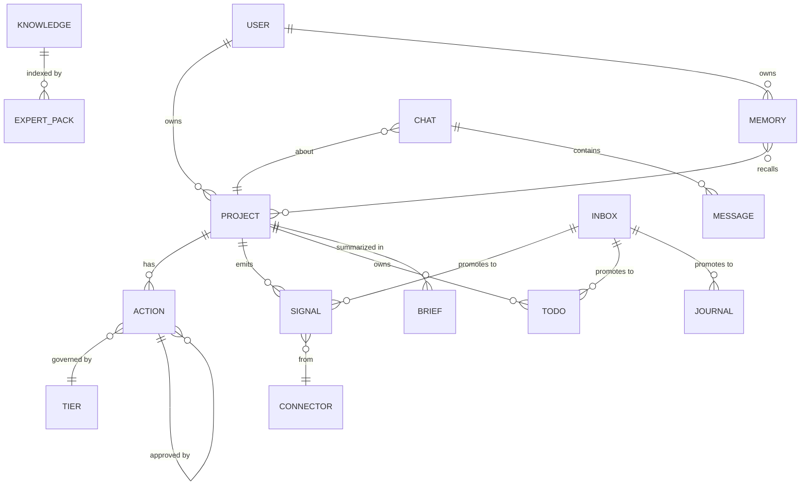

# 40 — Domain

The core nouns. If two parts of the codebase use the same word for
different things, that's a bug. If two parts use different words for
the same thing, that's also a bug.

## The noun model

## Glossary

**Action** — a recorded intent for Kitty to do something. Has a tier
(T0..T3), a status (proposed, approved, executed, failed), a preview
(the exact thing it will do), and a result (what it actually did). No
outbound action runs without an action row.

**Action tier** — the risk class of an action. T0 self-executes
(read-only). T1+ requires explicit human approval. Tiers are defined
in `config/action_tiers.json` and enforced in the executor registry,
in code.

**Brief** — a composed message pushed to Jacob's phone: morning brief
on cron, brief-v2 on state diff, urgent sweeps on deadline alerts.
The brief is the primary way Jacob interacts with Kitty; the chat UI
is secondary.

**Capture** — the act of writing something to `data/inbox.jsonl` from
any client. The capture path is durable without the gateway being up.

**Connector** — a cron-polled adapter that fetches new external state
(mail, web monitor) and emits deduped signal rows. No webhooks, no push.

**Expert pack** — a curated knowledge base for a specific domain (car,
body, etc.) indexed in ChromaDB. The expert retrieval path is local-only
per [ADR-0011](../adr/0011-privacy-boundary-in-llm-router.md).

**Inbox** — `data/inbox.jsonl`. Append-only, line-oriented, the capture
contract. Downstream code promotes inbox entries into richer stores
(todos, signals, journal).

**Journal** — Kitty's reflective log. Local-only content class; never
sent to cloud models.

**Knowledge** — the long-term reference corpus. Vectors live in
ChromaDB; the source excerpts are local-only content class.

**Memory** — the personal semantic memory layer (mem0). Used for
"remember this" facts that should resurface in future prompts.

**Packet** — a unit of work in `docs/packets/`. One packet = one branch
= one PR. Has an activation class (idea_seed, decision,
spec_candidate, active_packet, after_move_in, parked, reject) and a
visible demo contract.

**Privacy boundary** — the rule that journal, mail-body, health-admin,
and uploaded-document content never reaches a cloud model, even when a
cloud model would otherwise be fine for the call. Enforced in
`call_llm` ([ADR-0011](../adr/0011-privacy-boundary-in-llm-router.md)).

**Project** — a long-running initiative that Kitty tracks. Has a
`resume()` composer that returns its current state. Cross-project
insight (packet 022) reads `resume()` for all active projects.

**Signal** — an event row in the signals table, emitted by a
connector. `seen` is derived from `processed_at`. Consumers (brief
scheduler, action-queue scan) read signals.

**SOUL** — the persona layer. Voice, tone, and identity. Lives in
`config/SOUL.md`; loaded by the prompt catalog. SOUL is a _voice_, not
a _personality_ — the product identity is the operating layer
([ADR-0010](../adr/0010-kitty-is-personal-operating-layer.md)).

**State home** — the dashboard that surfaces the current state
(packet 004). Chats list, project state, action queue, brief data.

**Tier** — see Action tier.

**Todo** — an item the user needs to do, not Kitty. Lives in
`todo_store`. Promoted from inbox or created directly.

**User** — Jacob. One user, one machine. The whole product is shaped
around this fact ([ADR-0002](../adr/0002-local-first-single-user.md)).

## Business rules (the load-bearing ones)

1. **Privacy first, locally enforced.** If a call carries a private
   content class, it goes to a local model. Period
   ([ADR-0011](../adr/0011-privacy-boundary-in-llm-router.md)).
2. **No autonomous outbound action without a queue row and (for T1+)
   approval.** This is what makes Kitty auditable.
3. **Capture is durable without the gateway.** The inbox JSONL exists
   so the highest-value moment (capturing a thought) never fails
   because the rest of the stack is down
   ([ADR-0005](../adr/0005-keep-inbox-jsonl-for-capture.md)).
4. **One storage story.** Subsystem DBs are debt; the move is toward
   `kitty.db` for everything that's app state
   ([ADR-0006](../adr/0006-phase-b-is-consolidation.md)).
5. **Push to the phone, don't make Jacob open an app.** Anything
   needing his eyes goes to iMessage or Pushover, not a UI
   ([ADR-0013](../adr/0013-phone-first-delivery-move-in-bar.md)).
6. **Phone is the primary surface.** Web UI is secondary. Telegram is
   out. Email is buried.
