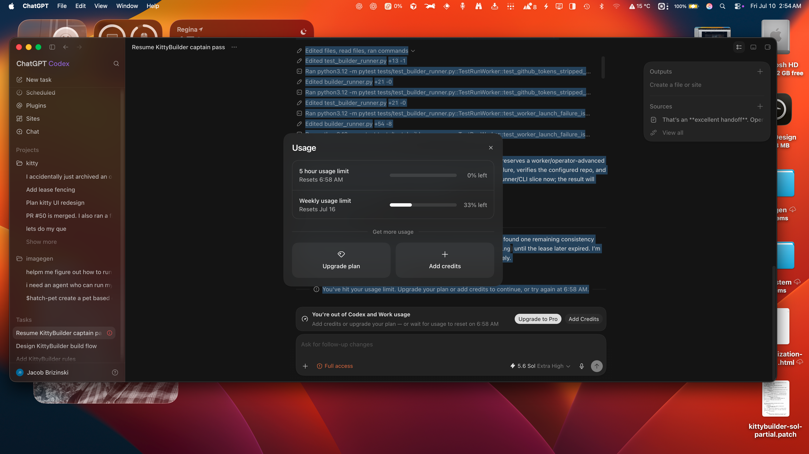

# Collection Bundle — Kitty / Open Engineer handoff

Generated: 2026-07-11. Companion to the Codex whole-codebase audit.

---

## 1. Open Engine — GitHub link (confirmed)

**https://github.com/svd-ai-lab/open-engineer**

Open-source engineering workbench built on OpenCode (`anomalyco/opencode`).
Windows x64 preview; bundles engineering/science skills + solver workflows
(COMSOL, Abaqus, Fluent, HFSS, MATLAB, etc.). MIT license, 18 stars, last
pushed 2026-07-11.

## 2. Command outputs

Recorded from the Codex report / handoff (no fresh re-run this session):

- Frontend: **116 tests passed** (`npm test -- --maxWorkers=1`); `npm run build` passed
- Backend: **24 focused Python tests passed**; Ruff + TypeScript (`tsc --noEmit`) passed
- Live services healthy; **browser visual QA unverified** (no browser runtime available)
- `./kitty doctor --json`: 13 pass, 2 warnings
  - Gmail token expired / refresh pending
  - Chroma has zero collections
  - Telegram disabled
  - No deadline watch active

That contradicts several docs claiming integrations and the "move-in" state are complete.

## 3. Screenshot (visual references — see `docs/fable-context/assets/`)

-  — `assets/kitty-ui-reference.png`
  (Jacob: "the UI that I like")
-  — `assets/kitty-mascot-reference.png`
  (Jacob: "blue squares around mascot/idea sketches")

> VERIFIED 2026-07-11 (Fable, visually): the originally collected Jul-10 screenshots
> were the wrong files entirely (a System Settings subscriptions dialog and a ChatGPT
> Codex usage screen). Replaced with the real Jul-8 sources from the Desktop:
> - UI reference = `Screenshot 2026-07-08 at 12.46.07 PM.png` — Google Stitch mock of a
>   dark space-themed Kitty dashboard: navy cosmos background, warm orange accents,
>   cards for AI News Brief, Local Pulse (weather), Daily Missions, Focus Mode timer,
>   Quick Links, System Status; hand-drawn white line-art cats throughout.
> - Mascot reference = `Screenshot 2026-07-08 at 12.47.21 PM.png` — blue selection
>   boxes around three sketchy line-art cats: starry-eyed cat-head logo, cat under a
>   rain cloud, loose standing doodle cat. Doodle line-art style is the preferred
>   mascot direction (not rendered/3D).
> - Side fact from the discarded Jul-10 Codex screenshot: Codex usage was exhausted
>   (0% of 5-hour window, 33% weekly left) — context for the free-worker push.

## 4. Kitty conversation

Not a single exportable paste. Sources:

- OpenCode collection session: `ses_0ad1f4378ffepPia4VmFdgTHR5` ("Collecting session data and outputs")
- Codex personality/pass rollout: `~/.codex/sessions/2026/07/11/rollout-2026-07-11T01-29-50-019f5015-...jsonl`
  (the Phase 3–5 task that produced the product commit)
- Live chat transcripts live in `data/` (kitty chat DB) and the opencode/codex stores above.

## 5. Current state after Codex's report (2026-07-12)

Repo: `feat/council-routing` based on `main` (`4b02645`).
Head: `ca04d20` — fail-loud sweep complete.

**Committed since the report:**
- `569608b` — verifier false-green, duplicate route contracts, fail-loud core paths
- `1cc6fbd` — Fable context bundle and visual references
- `92dc9ee` — replaced mis-collected visual references
- `907c6c0` — Kitty blueprint and ADR 0015 (resume loop, Builder boundary)
- `1156dad` — Fable session wrap, QA evidence, trust-lane-v1, bookkeeping
- `facdec6` — enrichment fail-loud markers (context_enrichment.py)
- `ca04d20` — bundle update, Card C closed

**Uncommitted on `feat/council-routing` (in progress):**
- `gateway/council.py` — council routing supervisor
- `gateway/routes/council.py` — POST /council route entrypoint
- `gateway/routes/register.py` — council route wiring
- `gateway/tutor.py`, `gateway/tutor_cli.py`, `gateway/routes/tutor.py` — tutor endpoint (untracked)
- `docs/council-routing-design.md`, `docs/tutor-design.md` — design docs (untracked)

---

## 6. WORK STARTED — Codex blockers addressed (2026-07-11)

Jacob approved starting internal (T1, non-security) blockers. Security
blocker #1 (LAN proxy + path-ingestion SSRF) was deliberately NOT started —
the report itself requires escalating security/auth work to Codex/Jacob first.

### Status table

| Blocker | Status | Files touched | Tests added |
|---|---|---|---|
| #2 Verifier false-green | ✅ DONE | `gateway/verifier.py` | `tests/test_verifier.py` (3) |
| #3 Duplicate route contracts | ✅ DONE | `gateway/routes/integrations.py`, `gateway/routes/insights.py` | `tests/test_route_contracts.py` (1) |
| #4 Fail-loud — model discovery | ✅ DONE | `gateway/model_digest.py` | `tests/test_model_digest.py` (3) |
| #4 Fail-loud — next-step prefs | ✅ DONE | `gateway/next_step.py` | `tests/test_next_step.py` (+2) |
| #4 Fail-loud — brief enrichment | ✅ DONE | `gateway/context_enrichment.py` | `tests/test_context_enrichment.py` (4) |
| #1 Security (LAN/SSRF) | ⛔ ESCALATE | — | — |
| #5–#9 (rest) | ⬜ OPEN | — | — |

**Verification (all backend-only changes):**
```
python3.12 -m pytest tests/test_verifier.py tests/test_model_digest.py \
                    tests/test_route_contracts.py tests/test_next_step.py \
                    tests/test_context_enrichment.py
# 24 passed

ruff check gateway/verifier.py gateway/model_digest.py gateway/next_step.py \
          gateway/routes/integrations.py gateway/routes/insights.py \
          gateway/context_enrichment.py \
          tests/test_verifier.py tests/test_model_digest.py \
          tests/test_route_contracts.py tests/test_next_step.py \
          tests/test_context_enrichment.py
# All checks passed!
```
No frontend build or broader slice was run. Nothing committed or pushed.

---

### Blocker #2 — Verifier false-green  ✅ DONE
**File:** `gateway/verifier.py`

Bug: `passed = proc.returncode == 0 or failed == 0`. A nonzero pytest exit
with an unparseable summary (empty run, collection error, crashed worker)
yielded `passed=True` — a false-green verdict.

Fix:
- `passed` is now authoritative on process exit: `passed_verdict = proc.returncode == 0 and failed == 0`.
- Added `returncode` to the result dict for transparency.
- Parser now counts `passed`/`failed` tokens independently, so a pure-pass
  (`"3 passed"`) or pure-fail (`"1 failed"`) line is tallied instead of left at zero.

Test: **`tests/test_verifier.py`** (new) — 3 cases including the direct
false-green regression (`returncode=1`, unparseable output → `passed is False`).

### Blocker #3 — Duplicate route contracts  ✅ DONE
**Files:** `gateway/routes/integrations.py`, `gateway/routes/insights.py`
**Test:** `tests/test_route_contracts.py` (new) — fails loudly if any
`(method, normalized-path)` is registered by more than one route module.

What was wrong (confirmed by registration order in `gateway/routes/register.py`):
- `integrations.py` was imported **before** `monitors.py` and `search.py`, so its
  copies of `/monitors`, `/monitor/*`, `/search` **shadowed** the dedicated,
  better-shaped modules. The Phase-3 fail-loud `monitors.py` wrapper and the
  richer `search.py` were effectively dead.
- `insights.py` duplicated `/dream/insights`, `/dream/trigger`, `/dream/status`
  already served (first-registered) by `routes/dream.py`.
- `integrations.py` `/cron/schedule` returned `{"schedule_id": sid}` while the
  frontend reads `json.id` from `cron.py` (which returns `{"id": sid}`) — the
  canonical copy.

What changed:
- Removed the duplicate cron, monitor, and search route blocks (and their now-unused
  `CronScheduleRequest` / `WatchCreateRequest` models) from `integrations.py`.
  `integrations.py` now owns only its unique endpoints (imessage, telegram, plugins,
  mcp, sync, search-via-dedicated, deploy, weather, build, verify, eval, nudges,
  health/patterns).
- Removed the dead `/dream/*` duplicates from `insights.py`; it now owns only
  `/insights` and `/insight/{id}/dismiss`. Dream paths live solely in `dream.py`.
- **Bonus fix:** consolidating resurrected the previously-shadowed fail-loud
  `monitors.py` wrapper and the richer `search.py` — both now win by default.

The route-contract test will catch any future cross-module duplicate.

### Blocker #4 — Fail-loud on core paths  ✅ DONE (two paths)
**File 1:** `gateway/model_digest.py` (chat model discovery)
Bug: `_load_recent_events` wrapped the SQLite read in `except Exception: return []`,
silently swallowing store outages so the morning brief's "Model News" section
appeared empty rather than reporting the failure.
Fix: added typed `ModelDigestError`; the read raises instead of returning `[]`;
`get_model_digest_section` returns an explicit `"## Model News\n- ⚠ model news
unavailable"` marker. Test: `tests/test_model_digest.py` (3).

**File 2:** `gateway/next_step.py` (the Home "What's Next" tile)
Bug: `_load_preferences` swallowed `OSError` (unreadable `PREFERENCES.md`) and
returned `""`, silently dropping user preferences from the generated step.
Fix: raises `NextStepError` (the module's existing error type, already raised by
`generate()` for other failures) so the read error surfaces instead of becoming a
fake-empty state. Test: `tests/test_next_step.py` (+2 cases: missing-file returns
`""`, unreadable raises `NextStepError`).

**File 3:** `gateway/context_enrichment.py` (morning-brief content)
Bug: `weather_text_sync` / `todos_text_sync` / `calendar_today_text_sync`
swallowed every exception and returned `""`, so a down todo-store / weather /
calendar source produced a silently empty section in the user-visible brief
(hides the outage). The module's own `run_enrichments` already propagates
warnings, so these sync helpers were inconsistent.
Fix: each returns an explicit `⚠ <source> unavailable` marker (plus a
`logger.warning`) instead of `""`, so the brief surfaces the failure. The
happy path (source returns text) is unchanged.
Test: `tests/test_context_enrichment.py` (4: per-source failure surfaces marker;
todos happy path returns text).

---

## 7. Codex report (full, pasted at end)

### Phase 3–5 product work
Passed review, committed, merged locally into `main`.
- Product commit: `14f5865`
- Merge commit: `c48186b`
- Verification: 116 frontend tests passed, production build passed, 24 focused Python tests passed, TypeScript and Ruff passed.
- Live services are healthy. Browser visual QA remains unverified because no browser runtime was available.
- No push was performed. `main` is ahead of `origin/main` by two commits.
- Existing unrelated changes were preserved in `.agents/`, `.claude/`, and `config/imagen/`.

### Whole-codebase audit

**Highest-priority blockers**
1. **LAN exposure risk** — UI starts on `0.0.0.0` while its proxy injects the gateway secret. A LAN client may invoke authenticated gateway actions. Fix: bind to localhost by default, or add UI auth + CSRF/origin protection. Files: `kitty`, `gateway/kitty-chat/src/app/proxy/[...path]/route.ts`
2. **False-green verification** — `gateway/verifier.py` can report success when pytest exits nonzero but the parser finds zero failures; empty/no-tests runs verify as passed. Add regression tests; make process exit status authoritative. **[STARTED — see §6]**
3. **Failed workers report completion** — `gateway/agent_runner.py` / `gateway/task_runner.py` can convert LLM/task failures into `completed`; `stop()` doesn't reliably cancel the async task. Dangerous for KittyBuilder orchestration trust.
4. **Path ingestion and SSRF** — authenticated capture/knowledge endpoints accept arbitrary local paths/URLs; redirects not sufficiently protected against localhost/private networks. Restrict to approved roots, validate redirects/IPs, cap response sizes.
5. **Duplicate route contracts** — cron/monitor/dream/insight routes duplicated across modules; registration order decides winner with inconsistent shapes. Files: `gateway/routes/integrations.py`, `cron.py`, `monitors.py`, `insights.py`, `dream.py`.
6. **Fail-loud violations** — many gateway/frontend functions convert failures into `[]`/`null`/`false`/empty/fake success (agents, todos, prompts, monitors, image gen, memory, chat model discovery, ingestion). Start with user-visible core paths. **[ONE PATH STARTED — see §6, model_digest]**
7. **Fake/incomplete continuity** — session close calls memory consolidation, but memory doesn't actually persist/consolidate; insights storage effectively empty/no-op.
8. **Request/upload limits incomplete** — declared `Content-Length` checked, but chunked requests and several uploads still read fully into memory. Voice/inventory uploads need streaming caps.
9. **Docs materially stale** — `docs/PROJECT_STATUS.md`, `docs/packets/README.md`, `START_HERE.md`, feature maps, architecture route tables disagree with current code. `./kitty doctor --json` contradicts docs claiming integrations/move-in complete.

**Recommended order:**
1. Fix UI proxy exposure and destructive/path-ingestion security.
2. Correct verifier, agent, and task failure semantics.
3. Consolidate duplicate routes and add route-contract tests.
4. Replace silent frontend/backend fallbacks on core user paths with explicit error envelopes.
5. Add browser smoke tests for boot, navigation, chat failure/success, settings save, feedback, and mobile layout.
6. Align CI Python versions, make frontend checks required, and add a coverage threshold.
7. Reconcile the canonical docs before using them as model context.
8. Build a seeded end-to-end "move-in bar" test covering morning brief, project next step, deadline, capture resurfacing, and auditable actions.
9. Only then pursue larger architectural cleanup such as storage consolidation and component decomposition.

### OpenCode/Fable workflow assessment
Reuse pattern: isolated worktree, one bounded task card, explicit allowed/forbidden files, free-model builder ladder, separate read-only reviewer, no worker push/merge, explicit test gates, operator-controlled publish.

Improve:
- Structured JSON worker/reviewer artifacts instead of parsing the last `APPROVE`/`BLOCK` log line.
- Record task ID, base SHA, worktree, model, changed files, tests, transcript path, and verdict in a run manifest.
- Use `./kitty builder queue` as the durable task state, with leases and explicit blocked/failed states.
- Run model/tool preflight before dispatch; treat startup failures and missing reports as tooling failures, not QA evidence.
- Add timeout, heartbeat, cancellation, and bounded retry behavior.
- Review a clean diff snapshot or separate checkout, not the builder's mutable worktree.
- Make live browser verification mandatory for UI tasks.
- Keep `.claude/STATE.md` coordinator-owned; workers should report state rather than race on it.
- Escalate security, auth, persistence, concurrency, and destructive-operation work to Codex/Jacob review.

Division:
- **Fable:** understand the product, generate the context pack, task card, acceptance criteria, risk tier, and sequencing.
- **OpenCode free agents:** implement bounded T0/T1 tasks in isolated worktrees.
- **Independent reviewer:** inspect and test without editing.
- **Codex/Jacob:** handle T2 safety review, merge, push, secrets, migrations, and broad architectural changes.

**Suggested Fable preload:** `AGENTS.md`; `docs/codemap/{README,00-overview,10-capabilities,20-dataflow,30-codemap,40-domain}.md`; `.claude/HANDOFF.md`; `.claude/STATE.md`; `docs/DECISIONS.md`; `docs/LEARNINGS.md`; `docs/KITTYBUILDER_ORCA_SETUP.md`; the live `./kitty doctor --json` output; the current git SHA and task-specific diff.

Tell Fable explicitly:
> Treat live code, tests, git state, and doctor output as authoritative over stale planning documents. Never expose `.env`, credentials, `data/`, `logs/`, personal runtime data, or raw provider transcripts to free endpoints. Every task must have a bounded scope, acceptance tests, risk tier, allowed files, forbidden files, independent review, and a machine-readable handoff. Failures must remain failures; never convert them into empty success states.

---

## 8. HANDOFF TO FABLE / NEXT AGENT — REMAINING WORK

Goal of this bundle: **set the next worker up for success**, not finish every
blocker here. #2, #3, #4 (two paths) are DONE and tested (§6). What follows is a
ready-to-dispatch set of bounded task cards. Risk tiers follow the report's own
escalation rule: **T2 (security/auth/persistence/concurrency/destructive) must be
escalated to Codex/Jacob**; T0/T1 may run in isolated worktrees via OpenCode free
agents with independent review.

### Card A — Blocker #1: LAN proxy exposure + path-ingestion SSRF  ⛔ T2 (escalate)
- **Why:** UI binds `0.0.0.0`; its proxy injects the gateway secret. Capture/knowledge
  endpoints accept arbitrary local paths/URLs; redirects not protected vs localhost/private nets.
- **Allowed files:** `gateway/kitty-chat/src/app/proxy/[...path]/route.ts`, gateway startup bind config, `gateway/routes/capture.py`, `gateway/routes/knowledge.py`
- **Forbidden:** touching auth/secrets/env, `.env`, payments.
- **Acceptance:** UI binds localhost by default (LAN opt-in behind explicit UI auth + CSRF/origin check); capture/knowledge reject paths outside approved roots, validate redirect/IP targets, cap response size. Regression test for each.
- **Handoff:** do NOT implement without Jacob/Codex sign-off. Open a T2 review note instead.

### Card B — Blocker #5: Failed workers report completion  ⛔ T2 (escalate, KittyBuilder)
- **Why:** `gateway/agent_runner.py` / `gateway/task_runner.py` can turn LLM/task failures into `completed`; `stop()` doesn't reliably cancel the async task. Corrupts orchestration trust.
- **Allowed files:** `gateway/agent_runner.py`, `gateway/task_runner.py`
- **Acceptance:** failure states propagate as `failed`/`interrupted` (never `completed`); `stop()` cancels the underlying task and is verified by a test.
- **Handoff:** escalate — concurrency + orchestration state.

### Card C — Blocker #6 (remaining): Fail-loud on other core paths  ✅ DONE
- **Scope:** sweep the remaining silent fallbacks the audit named — `agents`, `todos`,
  `prompts`, `monitors`, `image generation`, `memory`, `ingestion` — and replace
  `return []/None/false/""` with explicit error envelopes or typed raises.
- **Resolution:**
  - `todos` — fixed: `context_enrichment.py` sync helpers now return `⚠ unavailable`
    markers (4 tests).
  - `prompts` — no silent-swallow violations found (zero excepts in `prompts.py`).
  - `monitors` — already fail-loud via the #3 consolidation.
  - `image gen` — `is_available()` is a connectivity probe (legitimate by design).
  - `ingestion` — `routes/capture.py` already fail-loud (logs, records failure state,
    re-raises).
  - `agents` / `memory` — covered by **Blocker #5** (T2, agent_runner) and **Blocker #7**
    (T1/T2, memory consolidation) — separate escalations, not Card C scope.

### Card D — Blocker #7: Fake/incomplete continuity  T1/T2
- **Why:** session close calls memory consolidation, but memory doesn't persist/consolidate; insights storage effectively empty/no-op.
- **Allowed files:** `gateway/memory_*.py`, `gateway/dream_insights.py`
- **Acceptance:** a closed session actually writes a consolidation record; insights store is non-no-op (or explicitly documented as intentionally disabled). Test proves persistence.

### Card E — Blocker #8: Request/upload limits  T1
- **Why:** `Content-Length` checked, but chunked requests and voice/inventory uploads still read fully into memory.
- **Allowed files:** upload handlers in `gateway/routes/*`, `gateway/capture.py`
- **Acceptance:** streaming caps on chunked + voice/inventory uploads; test that an oversized chunked body is rejected.

### Card F — Blocker #9: Browser smoke tests  T1
- **Why:** no automated boot/nav/chat/settings/feedback/mobile smoke.
- **Allowed files:** `gateway/kitty-chat/` Playwright specs; `tests/` browser harness
- **Acceptance:** a Playwright suite covering boot, navigation, chat success+failure,
  settings save, feedback, mobile layout; runs in CI or a worker with a browser.
- **Note:** the report's own rule — UI tasks require live browser verification.

### Card G — Blocker #10: CI alignment + coverage  T1
- **Allowed files:** `.github/workflows/*`, `pyproject.toml`, `Makefile`
- **Acceptance:** CI Python versions aligned; frontend checks required; a coverage threshold added.

### Card H — Blocker #11: Doc reconciliation  T1
- **Why:** `docs/PROJECT_STATUS.md`, `docs/packets/README.md`, `START_HERE.md`,
  feature maps, architecture route tables disagree with code; `./kitty doctor --json`
  contradicts "move-in complete" claims.
- **Allowed files:** `docs/*`, `START_HERE.md`
- **Acceptance:** docs match current routes/tests/doctor output; a check or manual
  diff confirms no stale "complete" claims.

### Card I — Blocker #12: Seeded "move-in bar" e2e  T1/T2
- **Acceptance:** one end-to-end test covering morning brief, project next step,
  deadline, capture resurfacing, and an auditable action. Escalate if it touches
  persistence/migrations.

### Fable preload (attach to every card)
`AGENTS.md`; `docs/codemap/{README,00-overview,10-capabilities,20-dataflow,30-codemap,40-domain}.md`;
`.claude/HANDOFF.md`; `.claude/STATE.md`; `docs/DECISIONS.md`; `docs/LEARNINGS.md`;
`docs/KITTYBUILDER_ORCA_SETUP.md`; this bundle (`COLLECTION-BUNDLE.md`); the live
`./kitty doctor --json`; current git SHA + the task-specific diff.

### Standing rules for the takeover agent
- Isolated worktree; one bounded task card; explicit allowed/forbidden files.
- Free-model builder ladder; separate read-only reviewer; no worker push/merge.
- Structured JSON handoff (task ID, base SHA, worktree, model, changed files, tests,
  transcript path, verdict). Failures stay failures.
- T2 (security/auth/persistence/concurrency/destructive) → escalate to Codex/Jacob.
- `.claude/STATE.md` is coordinator-owned; workers report state, don't race on it.
- Never expose `.env`, credentials, `data/`, `logs/`, personal runtime, transcripts.
